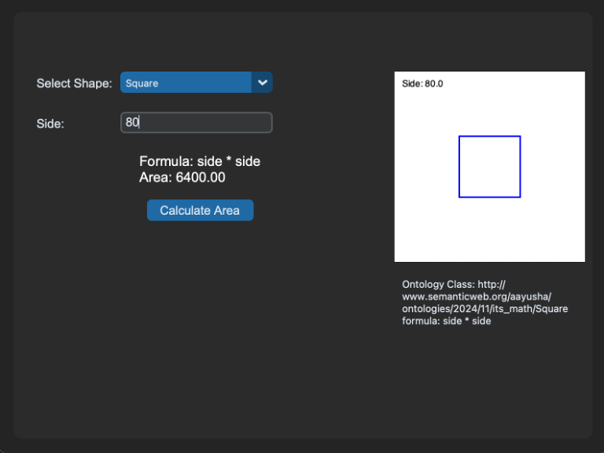

# Geometric Area Calculator

This project is a geometric area calculator that utilizes an ontology to define shapes and their area formulas. It consists of a backend API built with FastAPI and a frontend GUI built with CustomTkinter (tkinter).

## Backend API (FastAPI)

The backend API is responsible for calculating the area of a given shape based on the provided dimensions and the formulas defined in the ontology.

## Dependencies

The project's dependencies are listed in the `requirements.txt` file.

**Installing Dependencies**

It's highly recommended to create a virtual environment before installing the dependencies:

1. **Create a virtual environment (optional but recommended):**

   - Using `venv` (built-in):

     ```bash
     python3 -m venv .venv  # Or python -m venv .venv
     ```

2. **Activate the virtual environment:**

   - On Windows:

     ```bash
     .venv\Scripts\activate
     ```

   - On macOS/Linux:

     ```bash
     source .venv/bin/activate
     ```

3. **Install the dependencies from `requirements.txt`:**

   ```bash
   pip install -r requirements.txt
   ```

This will install all the required packages and their correct versions into your virtual environment.

## Ontology (ontology.owl)

The `ontology.owl` file defines the knowledge base for this project using the Web Ontology Language (OWL). It includes:

- **Classes:** `Shape`, `Circle`, `Square`, `Rectangle`, `Triangle`.
- **Data Property:** `formula` (associates a shape with its area calculation formula).
- **Individuals:** Instances of each shape class (e.g., `Circle_1`, `Square_1`).
- **Data Property Assertions:** Assigning specific formulas to each shape individual.

## Running the API

1. **Navigate to the backend directory:**

   ```bash
   cd be
   ```

2. **Start the FastAPI development server:**

   ```bash
   fastapi dev api.py
   ```

   This will start the server at `http://127.0.0.1:8000`.

### API Endpoints

- `/calculate_area/`: Calculates the area of a specified shape.

  - Method: `GET`
  - Parameters:

    - `shape_name` (string, required): The name of the shape (e.g., "Circle", "Square").
    - `radius` (float, optional): Radius of the circle.
    - `side` (float, optional): Side length of the square.
    - `length` (float, optional): Length of the rectangle.
    - `width` (float, optional): Width of the rectangle.
    - `base` (float, optional): Base of the triangle.
    - `height` (float, optional): Height of the triangle.

  - **Example Request:**

    Using `curl`:

    ```bash
    curl -X 'GET' \
      'http://localhost:8000/calculate_area/?shape_name=Circle&radius=50' \
      -H 'accept: application/json'
    ```

    **Request URL:**

    ```
    http://localhost:8000/calculate_area/?shape_name=Circle&radius=50
    ```

    **Response:**

    ```json
    {
      "shape": "Circle",
      "formula": "3.14159 * radius * radius",
      "area": 7853.974999999999
    }
    ```

## Frontend GUI (CustomTkinter (tkinter))

The frontend GUI provides a user-friendly interface to interact with the API. It allows users to select a shape, input dimensions, visualize the shape, and see the calculated area along with the corresponding formula.

### Running the GUI

1. **Navigate to the GUI directory:**

   ```bash
   cd gui
   ```

2. **Run the GUI application:**

   ```bash
   python main.py  # or python3 main.py if needed
   ```

### GUI Features

- **Shape Selection:** A dropdown menu to select the desired shape (Square, Circle, Rectangle, Triangle).
- **Dimension Inputs:** Dynamically generated input fields based on the selected shape.
- **Shape Visualization:** Displays an SVG representation of the selected shape with the given dimensions.
- **Area Calculation:** Sends a request to the API to calculate the area and displays the result.
- **Formula Display:** Shows the formula used for the area calculation.
- **Ontology Information:** Displays relevant information from the ontology, such as the class IRI and data properties (formula) for the selected shape.

### Screenshots

**Shape Selection:**


**Triangle:**


**Square:**


**Circle:**


**Rectangle:**


## Notes

- Make sure the FastAPI server is running before starting the GUI.
- The ontology file (`ontology.owl`) should be in the `ontology` directory, as specified in the code.
